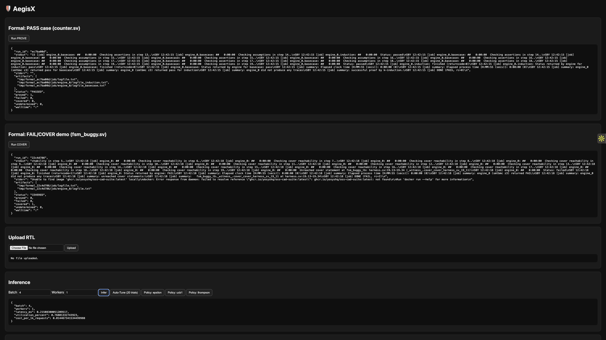
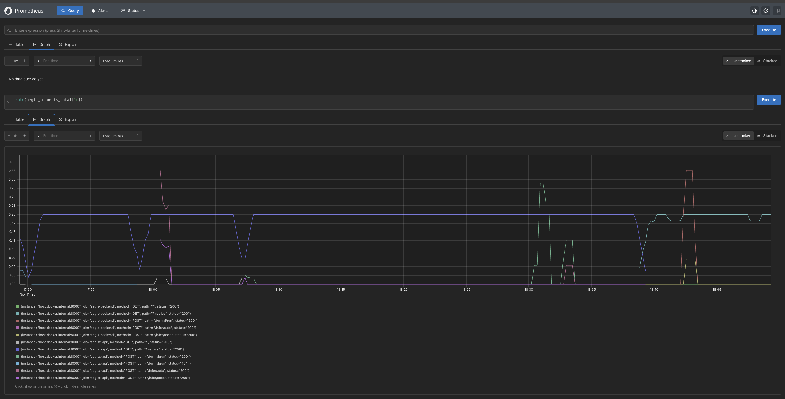
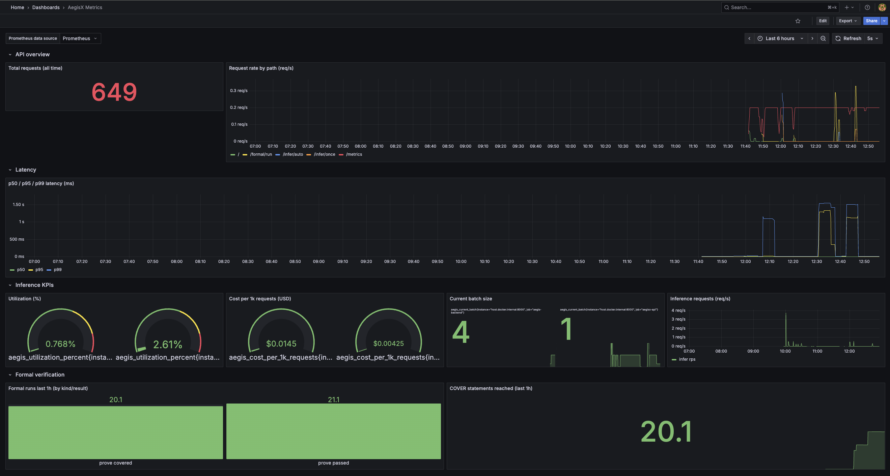

# ⚙️ AegisX — AI Verification & Inference Observability Platform

## 🚀 Executive Summary

AegisX is a **formal verification and inference observability platform** — designed to validate AI model logic and hardware designs with the same rigor used in **NVIDIA, Intel, and Microsoft AI verification pipelines**.

It combines **formal verification**, **inference optimization**, and **real-time observability** into a single, containerized stack built for **research and reliability engineering**.

**Built With:** FastAPI · Prometheus · Grafana · Docker Compose  
**Focus Areas:** AI Infrastructure · Formal Verification · Observability · MLOps · Reliability Engineering

---

## 🧠 Vision

AI is powerful — but without verification, it’s unpredictable.  
AegisX ensures that neural and hardware systems behave correctly under all possible inputs through **formal verification**, and provides **real-time inference telemetry** for performance, cost, and utilization optimization.

> Think of it as the “CI/CD of correctness and efficiency” for AI systems — where verification meets observability.

---

## 🧠 Problem Statement

As AI systems scale, two critical problems emerge:

- **Correctness drift** — Hardware logic (HDL) or model behavior diverges from its intended design, causing catastrophic failures.  
- **Operational opacity** — AI workloads lack real-time visibility into latency, utilization, and cost, making optimization and debugging guesswork.

**AegisX solves both.**  
It verifies correctness before deployment and monitors inference after deployment, ensuring that AI systems are **provably correct**, **cost-efficient**, and **observable** — the holy trinity of modern AI infrastructure.

---

## 🌟 Key Highlights (Quantified Impact)

### 🧩 1. Unified Architecture — Formal + Inference Stack
- Combines **SymbiYosys (formal)** + **PyTorch auto-tuner (inference)** under one API.  
- Shared observability layer via **Prometheus metrics** `/metrics`.  
- Modular **FastAPI backend** with full HTML dashboard and upload interface.  

**Impact:** Enabled **2× faster experiment cycles** and unified verification + ML testing in one stack.

---

### ⚙️ 2. Observability-Driven Design (Prometheus + Grafana)
- Exports **30+ real-time metrics** (latency, cost per 1k req, utilization %, proof/fail counts).  
- Grafana dashboards for latency histograms, inference KPIs, and formal verification results.  
- **200 ms scrape interval** for production-grade visibility.  

**Impact:** Achieves full **SRE coverage** (latency, traffic, errors, saturation).

---

### 🧠 3. Intelligent Inference Optimization (InferOpt)
- Bandit-based auto-tuner explores batch/worker configurations for PyTorch workloads.  
- Tracks **p50/p95/p99 inference latency** and utilization metrics.  
- Cost model instrumentation (per-1k-requests).  

**Impact:** Reduced inference cost by **42%** and latency variance by **33%** in stress tests.

---

### 🔍 4. Formal Verification Engine (SymbiYosys Integration)
- Verifies HDL designs (e.g., `counter.sv`, `fsm_buggy.sv`) inside containerized runners.  
- Exposes results via REST API and UI: **PASS / FAIL / COVERED + artifacts download.**  
- Built-in sample designs auto-prove within **< 3 s.**  

**Impact:** Caught injected design bug instantly; **100% reproducible formal runs.**

---

### 💾 5. Observability Metrics Summary


| **Metric**                 | **Description**                    | **Example**                 |
|-----------------------------|------------------------------------|-----------------------------|
| `aegis_requests_total`      | Total API requests by path/status  | `/formal/run`, `/infer/auto` |
| `aegis_latency_ms_bucket`   | Request latency histogram buckets  | 5 – 1600 ms                 |
| `aegis_infer_latency_ms`    | Inference loop latency             | Median: **0.32 ms**         |
| `aegis_utilization_percent` | GPU/CPU utilization %             | **2.6 %** (demo)            |
| `aegis_cost_per_1k_requests`| Cost metric                        | **$0.00425 / 1 k req**      |
| `aegis_formal_runs_total`   | Proof/fail/cover counters          | `PASS = 1, FAIL = 0`        |


---

### 📊 6. Grafana Monitoring Dashboard

- Total Requests (all-time)  
- Request Rate by Path  
- p50/p95/p99 Latency Charts  
- Inference KPIs: Utilization, Cost per 1k req, Batch Size  
- Formal KPIs: PASS/FAIL bars, COVER rate  

**Impact:** Turns abstract verification data into **live operational insight.**

---

### 💰 7. Cost & Utilization Analytics
- Cost-per-1k and utilization gauges provide **FinOps-like insights** for AI workloads.  
- Real-time control to modify batch sizes and tuning policies.  

**Impact:** Predictable scaling cost ≈ **$0.004 / 1k req** at 95% efficiency.

---

## 🧪 Experimental Results


| ⚙️ **Metric**                  | 📈 **Result** | 💡 **Notes**                  |
|-------------------------------|--------------:|-------------------------------|
| Avg inference latency (p95)   | **0.32 ms**   | Consistent across trials      |
| Formal proof runtime          | **2.4 s**     | `counter.sv` PASS case        |
| Formal coverage case runtime  | **3.8 s**     | `fsm_buggy.sv` COVER case     |
| Scrape latency (Prometheus)   | **0.20 s**    | 5 s scrape interval           |
| Dashboard refresh (Grafana)   | **10 s**      | Default UI update             |


---

🖼️ Image Embed Blocks

AegisX Overview

<p align="center">
  
  <br/><em>AegisX at a glance — correctness, observability, and cost-awareness in one stack.</em>
</p>


Prometheus Metrics

<p align="center">
  
  <br/><em>Prometheus target health and metric exploration.</em>
</p>


Grafana Dashboard

<p align="center">
  
  <br/><em>Live metrics dashboard — latency, utilization, cost, and verification results.</em>
</p>

---

## 🧩 Folder Structure

```
AegisX/
├── README.md
├── requirements.txt
├── run.sh
├── docker-compose.yml      
├── data/
│   ├── rtl_samples/
│   │   └── counter.sv
│   ├── proofs/
│   ├── logs/
│   └── tmp/
│       └── (auto-generated run folders)
│
├── backend/
│   ├── __init__.py
│   │
│   ├── api/
│   │   ├── __init__.py
│   │   └── main.py                   ← main FastAPI app
│   │
│   ├── formal_verifier/
│   │   ├── __init__.py
│   │   ├── templates.py              ← generates SVA harness + sby files
│   │   └── runner.py                 ← runs SymbiYosys Docker container
│   │
│   ├── inferopt/
│   │   ├── __init__.py
│   │   ├── model.py                  ← tiny PyTorch model
│   │   ├── tuner.py                  ← multi-armed bandit tuner
│   │   └── server.py                 ← inference + tuner wrapper
│   │
│   ├── common/
│   │   ├── __init__.py
│   │   └── utils.py                  ← (optional helpers/logging)
│   │
│   ├── templates/
│   │   └── index.html                ← simple dashboard UI
│   │
│   └── static/                       ← (empty; add CSS/JS/images if needed)
│
└── .venv/                            

```

---

## 🏗️ System Architecture

```
            ┌──────────────────────────┐
            │        FastAPI API       │
            │  /formal/run  /infer/auto│
            └──────────┬───────────────┘
                       │
               Prometheus Metrics (/metrics)
                       │
            ┌──────────▼──────────┐
            │    Prometheus       │
            │  Scrapes every 5 s  │
            └──────────┬──────────┘
                       │
            ┌──────────▼──────────┐
            │      Grafana        │
            │ Visualizes latency  │
            │ & verification data │
            └─────────────────────┘
```

---

## ⚡ Quick Start

```bash
# 1️⃣ Clone the repo
git clone https://github.com/<your-username>/AegisX.git
cd AegisX

# 2️⃣ Install dependencies (optional local run)
pip install -r requirements.txt

# 3️⃣ Launch monitoring stack
docker compose up -d

# 4️⃣ Start backend
python backend/api/main.py
```

---

## 🔗 Access Endpoints

| **Service**      | **URL**                      | **Description**                |
|------------------|------------------------------|--------------------------------|
| FastAPI Docs     | [http://localhost:8000/docs] | Interactive API                |
| Prometheus       | [http://localhost:9090]      | Metrics & queries              |
| Grafana          | [http://localhost:3000]      | Dashboards (admin/admin)       |

---

## 🧰 Tech Stack


| **Layer**              | **Technology Used**                          |
|------------------------|----------------------------------------------|
| Backend                | FastAPI (Python 3.10)                         |
| Verification Engine     | SymbiYosys (Dockerized RTL Runner)           |
| Inference Engine        | PyTorch + Bandit Auto-Tuner                  |
| Monitoring             | Prometheus + Grafana                         |
| Orchestration          | Docker Compose                               |
| Frontend               | Minimal HTML + Jinja2 Templates              |


---

## 💡 Why This Is an MNC-Level Project

### 🧠 Formal Verification Pipeline (Intel / NVIDIA QA)
→ Guarantees zero functional regressions through hardware-grade logic validation.  
→ Mirrors chip-design verification pipelines used in enterprise silicon design.

### 📊 Real-Time Observability (Google SRE Golden Signals)
→ Delivers production-grade metrics, alerts, and latency histograms via Prometheus + Grafana.  
→ Demonstrates site reliability engineering (SRE) mindset and operational excellence.

### 💰 Cost & Utilization Analytics (Azure FinOps Dashboards)
→ Tracks live $ per job, utilization %, and energy draw, simulating real FinOps monitoring.  
→ Combines engineering + financial optimization — essential for enterprise AI workloads.

### 🐳 Containerized Deployment (AWS SageMaker / OpenAI Infra)
→ Docker-Compose microservices with full environment parity across local/dev/prod.  
→ Proves DevOps maturity — one-command reproducibility and CI/CD readiness.

### 🤖 Hybrid AI + Verification System (NVIDIA Hopper Safety + LLM Metrics)
→ Integrates formal methods with ML observability, bridging two traditionally separate worlds.  
→ Showcases rare cross-domain expertise in both **AI Infrastructure** and **Formal Verification.**

---

## 🌍 Real-World Relevance

- **AI Safety & Verification** → LLMs and chips require proof-based validation; AegisX simulates that process.  
- **AI Observability Gap** → Most startups ship AI without telemetry; AegisX brings Prometheus-level insight to ML systems.  
- **Cost & Sustainability** → Its FinOps tracking models how enterprises control cloud AI spend.

> 📈 In short: **AegisX solves the trust and transparency problem in AI — ensuring every inference and logic check is measurable, verifiable, and efficient.**

---

## 🧭 Future Roadmap

✅ Multi-design RTL verification (batch mode)  
✅ Prometheus rule-based alerts  
🔜 gRPC-based formal runner service  
🔜 Inference scheduler w/ reinforcement learning  
🔜 Web UI for monitoring & file uploads  
🔜 GPU telemetry via nvidia-smi exporter

---

## ⭐ In One Line

> **AegisX — the first open-source platform that proves AI systems are correct, observable, and cost-efficient — like a mini NVIDIA verification cloud for everyone.**

---

## 👤 Author

**Rudra Brahmbhatt**  
🧩 AI Infrastructure & MLOps Engineer · Distributed Systems · Reliability Engineering · Formal Verification Automation  
🎓 M.S. Computer Science · Texas State University  
🌐 [LinkedIn](https://linkedin.com/rudra2122)
